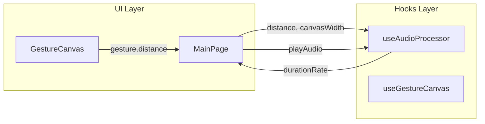

# Design Document: duration-ratio-canvas

## Overview

**Purpose**: 本機能は、ジェスチャー入力による音声再生時間の算出ロジックを改善し、キャンバスサイズに連動した動的比率計算を提供する。

**Users**: アプリケーションのエンドユーザーは、異なる長さの音声ファイルを使用する際に一貫した操作感を得られる。

**Impact**: 既存の固定比率（20px = 元の音声長さ）を動的比率（キャンバス幅の半分 = 元の音声長さ）に変更する。

### Goals
- キャンバス幅の半分を基準距離として再生時間倍率を算出する
- 異なるキャンバスサイズでも一貫した操作感を維持する
- 既存のAPIインターフェースを拡張しつつ後方互換性に配慮する

### Non-Goals
- キャンバスのリサイズ機能の実装（将来対応）
- ピッチ変換・再生方向ロジックの変更
- UIコンポーネントの視覚的変更

---

## Architecture

### Existing Architecture Analysis

現在のシステムは以下のデータフローを持つ：

```
[GestureCanvas] → gesture.distance → [MainPage] → calculateDurationRate(distance) → durationRate → playAudio()
```

**現状の制約**:
- `calculateDurationRate`は`distance`のみを引数に取り、`canvasWidth`を知る方法がない
- `BASE_DISTANCE_PX = 20`がハードコードされている

### Architecture Pattern & Boundary Map



**Architecture Integration**:
- **Selected pattern**: 関数シグネチャ拡張（引数追加）
- **Domain boundaries**: Hooks層に計算ロジックを維持、UI層からパラメータを注入
- **Existing patterns preserved**: カスタムフック分離パターン、純粋関数としての`calculateDurationRate`
- **New components rationale**: 新規コンポーネント不要、既存フックの拡張のみ
- **Steering compliance**: TypeScript strict mode、フックによるロジック分離

### Technology Stack

| Layer | Choice / Version | Role in Feature | Notes |
|-------|------------------|-----------------|-------|
| Frontend | React 18.2 / Next.js 14 | ページコンポーネントからcanvasWidth伝達 | 変更なし |
| Hooks | TypeScript 5.3 | calculateDurationRate関数シグネチャ拡張 | 主要変更箇所 |
| Testing | Jest 29.7 | テストケース更新 | 既存テスト修正 |

---

## Requirements Traceability

| Requirement | Summary | Components | Interfaces | Flows |
|-------------|---------|------------|------------|-------|
| 1.1 | キャンバス幅の半分を基準距離に | useAudioProcessor | calculateDurationRate | 比率算出 |
| 1.2 | 半分の長さで全体再生 | useAudioProcessor | calculateDurationRate | 比率算出 |
| 1.3 | 2倍の長さで2倍再生 | useAudioProcessor | calculateDurationRate | 比率算出 |
| 1.4 | 1/4の長さで半分再生 | useAudioProcessor | calculateDurationRate | 比率算出 |
| 1.5 | 線形比率維持 | useAudioProcessor | calculateDurationRate | 比率算出 |
| 2.1 | キャンバス幅取得 | MainPage | CANVAS_WIDTH定数 | パラメータ伝達 |
| 2.2 | 動的参照 | MainPage → useAudioProcessor | calculateDurationRate | パラメータ伝達 |
| 2.3 | サイズ変更対応 | MainPage | CANVAS_WIDTH | 将来対応 |
| 3.1 | API互換性 | useAudioProcessor | calculateDurationRate | シグネチャ拡張 |
| 3.2 | ジェスチャー検出維持 | useGestureCanvas | - | 変更なし |
| 3.3 | ピッチ・方向維持 | useAudioProcessor | calculatePitchRate, isReversePlayback | 変更なし |

---

## Components and Interfaces

### Summary

| Component | Domain/Layer | Intent | Req Coverage | Key Dependencies | Contracts |
|-----------|--------------|--------|--------------|------------------|-----------|
| useAudioProcessor | Hooks | 音声処理ロジック | 1.1-1.5, 3.1, 3.3 | - | Service |
| MainPage | UI/Pages | メインアプリ画面 | 2.1, 2.2, 2.3 | useAudioProcessor (P0) | - |

---

### Hooks Layer

#### useAudioProcessor

| Field | Detail |
|-------|--------|
| Intent | 音声処理ロジックおよびパラメータ計算を提供する |
| Requirements | 1.1, 1.2, 1.3, 1.4, 1.5, 3.1, 3.3 |

**Responsibilities & Constraints**
- 線の長さとキャンバス幅から再生時間倍率を算出する
- 既存のピッチ計算・再生方向判定ロジックには影響を与えない
- 純粋関数として維持し、テスタビリティを確保する

**Dependencies**
- Inbound: MainPage — calculateDurationRate呼び出し (P0)
- Outbound: Web Audio API — 音声再生 (P0)

**Contracts**: Service [x]

##### Service Interface

```typescript
interface AudioProcessorHook {
  // ... 既存のプロパティ（変更なし）

  /**
   * 線の長さとキャンバス幅から再生時間倍率を計算する
   * @param distance - 線の長さ（ピクセル）
   * @param canvasWidth - キャンバスの幅（ピクセル）
   * @returns 再生時間倍率（1.0 = 元の音声長さ）
   */
  calculateDurationRate: (distance: number, canvasWidth: number) => number;

  // ... 既存のメソッド（変更なし）
  calculatePitchRate: (normalizedY: number) => number;
  isReversePlayback: (xDelta: number) => boolean;
}
```

**計算ロジック**:
```
baseDistance = canvasWidth / 2
durationRate = distance / baseDistance
```

- **Preconditions**:
  - `distance >= 0`
  - `canvasWidth > 0`
- **Postconditions**:
  - `durationRate >= 0`
  - `durationRate`は線形に比例
- **Invariants**:
  - `distance === canvasWidth / 2` のとき `durationRate === 1.0`

**Implementation Notes**
- Integration: `BASE_DISTANCE_PX`定数を削除し、動的計算に置換
- Validation: `canvasWidth <= 0`の場合はデフォルト値（800px）を使用
- Risks: 既存テストの修正が必要

---

### UI Layer

#### MainPage

| Field | Detail |
|-------|--------|
| Intent | キャンバスサイズを管理し、calculateDurationRateに渡す |
| Requirements | 2.1, 2.2, 2.3 |

**Responsibilities & Constraints**
- `CANVAS_WIDTH`定数を保持し、`calculateDurationRate`呼び出し時に渡す
- ジェスチャー完了時のハンドラで`canvasWidth`を引数に追加

**Dependencies**
- Inbound: GestureCanvas — onGestureComplete (P0)
- Outbound: useAudioProcessor — calculateDurationRate (P0)

**Implementation Notes**
- Integration: `handleGestureComplete`内で`calculateDurationRate(gesture.distance, CANVAS_WIDTH)`を呼び出す
- Validation: 不要（定数値を使用）
- Risks: 最小限（1行の変更）

---

## Data Models

本機能はデータモデルの変更を伴わない。計算ロジックの変更のみである。

---

## Error Handling

### Error Strategy

本機能は計算ロジックの変更であり、新たなエラーシナリオは発生しない。

**Edge Cases**:
| Case | Handling |
|------|----------|
| `canvasWidth <= 0` | デフォルト値800を使用 |
| `distance < 0` | 0として扱う |

---

## Testing Strategy

### Unit Tests
- `calculateDurationRate(400, 800)` → `1.0`（キャンバス幅の半分 = 全体再生）
- `calculateDurationRate(800, 800)` → `2.0`（キャンバス幅 = 2倍再生）
- `calculateDurationRate(200, 800)` → `0.5`（キャンバス幅の1/4 = 半分再生）
- `calculateDurationRate(0, 800)` → `0`（ゼロ距離）
- `calculateDurationRate(400, 0)` → デフォルト動作確認

### Integration Tests
- ジェスチャー完了 → `calculateDurationRate`呼び出し → 正しい`durationRate`が`playAudio`に渡される
- 既存のピッチ・方向ロジックが影響を受けないことを確認

### Affected Existing Tests
以下の既存テストは修正が必要：
- `useAudioProcessor.test.ts`: `calculateDurationRate`のテストケース（引数追加）
- `audio-processing-flow.test.ts`: 統合テストでの呼び出し変更
- `page.test.tsx`: モック定義の更新
