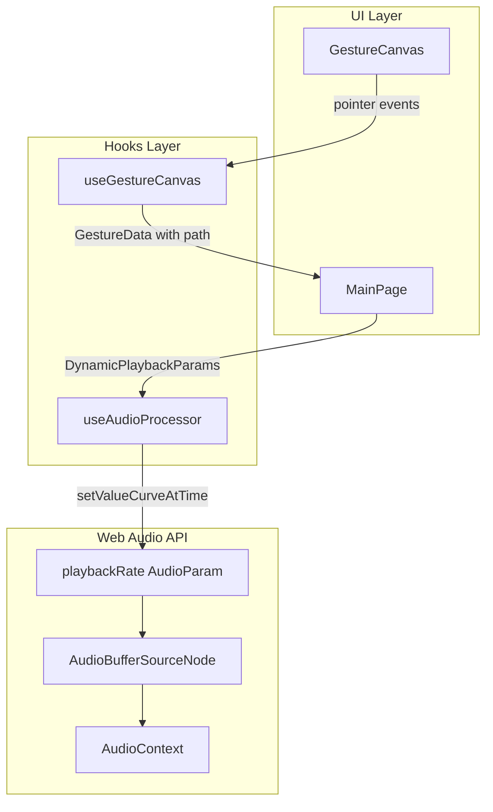
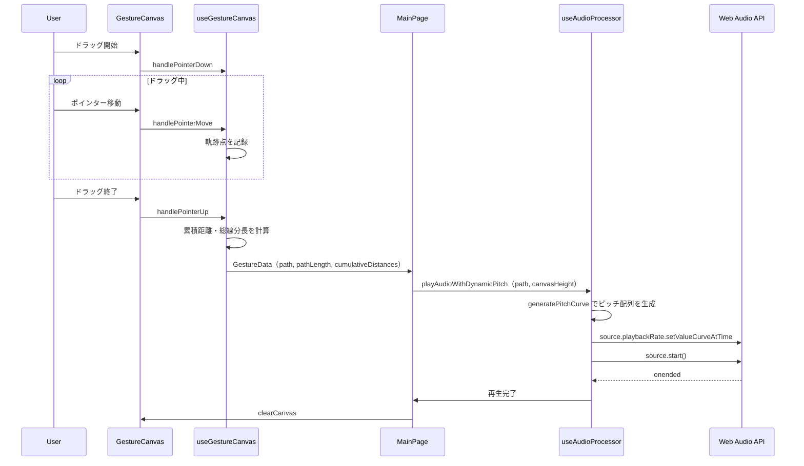

# Design Document: dynamic-pitch-pathlen

## Overview

**Purpose**: 本機能は、ジェスチャー軌跡に基づく音声パラメータ算出ロジックを改善し、軌跡のY座標に連動した動的ピッチ変化と、軌跡総線分長に基づく再生時間計算を提供する。

**Users**: アプリケーションのエンドユーザーは、画面上部で高音・下部で低音という直感的な操作で音声を表現でき、曲線軌跡を描くことでピッチが動的に変化する音声体験を得られる。

**Impact**: 既存の`useAudioProcessor`と`useGestureCanvas`フックを拡張し、逆再生機能を廃止する破壊的変更を含む。

### Goals
- 軌跡上のY座標位置に基づくピッチ計算（1倍〜5倍）
- 再生中に軌跡に沿ってピッチが動的に変化
- 軌跡総線分長による再生時間計算
- X座標方向に関わらず常に順再生（逆再生廃止）

### Non-Goals
- ピッチと再生速度の分離（タイムストレッチ）
- キャンバスリサイズへの動的対応
- 複数音声の同時操作

---

## Architecture

### Existing Architecture Analysis

現在のシステムは以下の構造を持つ：

- `useGestureCanvas`: 軌跡記録、始点-終点間の直線距離計算
- `useAudioProcessor`: ピッチ計算（始点Y座標ベース）、再生時間計算（直線距離ベース）、逆再生対応
- `MainPage`: 両フックを統合、ジェスチャー完了時にパラメータ計算・再生トリガー

**現状の制約**:
- `calculatePitchRate`は始点のnormalizedYのみを使用（静的ピッチ）
- `GestureData.distance`は始点-終点間の直線距離
- `playAudio`は固定の`pitchRate`を受け取る

### Architecture Pattern & Boundary Map



**Architecture Integration**:
- **Selected pattern**: 既存フック拡張パターン（新規コンポーネント不要）
- **Domain boundaries**: Hooks層にロジックを集約、UI層は呼び出しのみ
- **Existing patterns preserved**: カスタムフック分離、TypeScript strict mode
- **New components rationale**: 新規コンポーネント不要、既存フックの拡張のみ
- **Steering compliance**: TypeScript strict mode、フックによるロジック分離を維持

### Technology Stack

| Layer | Choice / Version | Role in Feature | Notes |
|-------|------------------|-----------------|-------|
| Hooks | TypeScript 5.x | 型安全なインターフェース拡張 | 新規型定義追加 |
| Audio | Web Audio API | setValueCurveAtTimeによる動的ピッチ | ブラウザネイティブ |
| Testing | Jest 29.x | ユニット・統合テスト | 既存テスト修正必要 |

---

## System Flows

### 動的ピッチ再生フロー



---

## Requirements Traceability

| Requirement | Summary | Components | Interfaces | Flows |
|-------------|---------|------------|------------|-------|
| 1.1 | 軌跡上の各点Y座標でピッチ算出 | useAudioProcessor | calculatePitchFromY | 動的ピッチ再生 |
| 1.2 | キャンバス上端で最大5倍 | useAudioProcessor | calculatePitchFromY | - |
| 1.3 | キャンバス下端で最小1倍 | useAudioProcessor | calculatePitchFromY | - |
| 1.4 | キャンバス中央で中間ピッチ | useAudioProcessor | calculatePitchFromY | - |
| 1.5 | Y座標とピッチの線形関係 | useAudioProcessor | calculatePitchFromY | - |
| 1.6 | ピッチ範囲1〜5倍 | useAudioProcessor | MIN/MAX_PITCH_RATE | - |
| 2.1 | 各点のY座標と累積距離を記録 | useGestureCanvas | GestureData | 動的ピッチ再生 |
| 2.2 | 累積距離に基づく動的ピッチ変更 | useAudioProcessor | playAudioWithDynamicPitch | 動的ピッチ再生 |
| 2.3 | 再生N%で累積距離N%のY座標適用 | useAudioProcessor | generatePitchCurve | 動的ピッチ再生 |
| 2.4 | 上方向でピッチ上昇 | useAudioProcessor | generatePitchCurve | - |
| 2.5 | 下方向でピッチ下降 | useAudioProcessor | generatePitchCurve | - |
| 2.6 | 滑らかな補間 | Web Audio API | setValueCurveAtTime | - |
| 3.1 | 全セグメント長の合計 | useGestureCanvas | calculatePathLength | - |
| 3.2 | ユークリッド距離計算 | useGestureCanvas | calculatePathLength | - |
| 3.3 | 曲線軌跡で長い再生時間 | useGestureCanvas | GestureData.pathLength | - |
| 3.4 | 総線分長とキャンバス幅半分の比率 | useAudioProcessor | calculateDurationRate | - |
| 3.5 | 軌跡未記録時は直線距離使用 | useGestureCanvas | calculatePathLength | - |
| 3.6 | ピッチによる再生速度変化許容 | useAudioProcessor | - | - |
| 4.1 | X方向に関わらず順再生 | useAudioProcessor | playAudioWithDynamicPitch | - |
| 4.2 | 逆再生機能廃止 | useAudioProcessor | - | - |
| 4.3 | 軌跡順序でピッチ変化 | useAudioProcessor | generatePitchCurve | - |
| 5.1 | 既存キャンバス描画ロジック再利用 | useGestureCanvas | - | - |
| 5.2 | playbackRateでピッチ変更 | useAudioProcessor | setValueCurveAtTime | - |
| 5.3 | フォールバック対応 | useAudioProcessor | playAudioWithStaticPitch | - |

---

## Components and Interfaces

### Summary

| Component | Domain/Layer | Intent | Req Coverage | Key Dependencies | Contracts |
|-----------|--------------|--------|--------------|------------------|-----------|
| useGestureCanvas | Hooks | 軌跡記録・累積距離計算 | 2.1, 3.1-3.5, 5.1 | Canvas API (P0) | Service |
| useAudioProcessor | Hooks | 動的ピッチ再生・パラメータ計算 | 1.1-1.6, 2.2-2.6, 3.4, 3.6, 4.1-4.3, 5.2-5.3 | Web Audio API (P0) | Service |
| MainPage | UI/Pages | フック統合・ピッチ配列生成 | 全要件の統合 | useGestureCanvas (P0), useAudioProcessor (P0) | - |

---

### Hooks Layer

#### useGestureCanvas

| Field | Detail |
|-------|--------|
| Intent | 軌跡の記録、累積距離・総線分長の計算を提供 |
| Requirements | 2.1, 3.1, 3.2, 3.3, 3.5, 5.1 |

**Responsibilities & Constraints**
- 軌跡の各点をPath配列として記録
- 各セグメントのユークリッド距離を計算し累積距離配列を生成
- 総線分長（pathLength）を算出
- 軌跡が2点未満の場合は直線距離にフォールバック

**Dependencies**
- External: Canvas 2D API — 座標変換・描画 (P0)

**Contracts**: Service [x]

##### Service Interface

```typescript
export interface Point {
  x: number;
  y: number;
}

export interface GestureData {
  startPoint: Point;
  endPoint: Point;
  path: Point[];
  /** 始点-終点間の直線距離（後方互換性のため維持） */
  distance: number;
  /** 軌跡の総線分長（全セグメント長の合計） */
  pathLength: number;
  /** 各点の累積距離（始点からの距離）*/
  cumulativeDistances: number[];
}

export interface GestureCanvasHook {
  // ... 既存プロパティ（変更なし）
  canvasRef: RefObject<HTMLCanvasElement>;
  isDrawing: boolean;
  currentPath: Point[];

  // ... 既存メソッド（変更なし）
  handlePointerDown: (e: React.PointerEvent<HTMLCanvasElement>) => void;
  handlePointerMove: (e: React.PointerEvent<HTMLCanvasElement>) => void;
  handlePointerUp: (e: React.PointerEvent<HTMLCanvasElement>) => GestureData | null;
  clearCanvas: () => void;
  getCanvasPoint: (clientX: number, clientY: number) => Point;

  // 変更: canvasHeightパラメータを削除（不要になる）
  // calculateGestureParams は廃止し、MainPageで直接計算
}
```

**Implementation Notes**
- `handlePointerUp`内で累積距離と総線分長を計算
- 累積距離配列は`[0, d1, d1+d2, ..., pathLength]`の形式
- 点数が1以下の場合、`pathLength = distance`（直線距離）にフォールバック

---

#### useAudioProcessor

| Field | Detail |
|-------|--------|
| Intent | 動的ピッチ再生、パラメータ計算、音声処理を提供 |
| Requirements | 1.1-1.6, 2.2-2.6, 3.4, 3.6, 4.1-4.3, 5.2, 5.3 |

**Responsibilities & Constraints**
- Y座標からピッチ倍率を計算（1.0〜5.0倍）
- `setValueCurveAtTime`を使用して再生中にピッチを動的に変更
- 逆再生機能を廃止し、常に順再生
- 動的ピッチが不可能な場合は平均Y座標による静的ピッチにフォールバック

**Dependencies**
- External: Web Audio API — AudioContext, AudioBufferSourceNode, AudioParam (P0)

**Contracts**: Service [x]

##### Service Interface

```typescript
/** 動的ピッチ再生用パラメータ */
export interface DynamicPlaybackParams {
  /** 再生時間倍率（pathLengthから算出） */
  durationRate: number;
  /** ピッチ曲線（Float32Array形式、setValueCurveAtTime用） */
  pitchCurve: Float32Array;
  /** 再生時間（秒） */
  duration: number;
}

/** 静的ピッチ再生用パラメータ（フォールバック用） */
export interface StaticPlaybackParams {
  durationRate: number;
  pitchRate: number;
}

export interface AudioProcessorHook {
  // 状態（変更）
  audioBuffer: AudioBuffer | null;
  // reversedBuffer は廃止
  isLoading: boolean;
  isPlaying: boolean;
  error: string | null;
  volume: number;

  // メソッド（既存）
  initializeAudioContext: () => Promise<void>;
  loadAudioFile: (file: File) => Promise<void>;
  loadSampleAudio: () => Promise<void>;
  setAudioBufferExternal: (buffer: AudioBuffer) => Promise<void>;
  stopAudio: () => void;
  setVolumeLevel: (volume: number) => void;

  // メソッド（変更・追加）
  /**
   * 軌跡総線分長とキャンバス幅から再生時間倍率を計算
   * @param pathLength - 軌跡の総線分長（ピクセル）
   * @param canvasWidth - キャンバスの幅（ピクセル）
   */
  calculateDurationRate: (pathLength: number, canvasWidth: number) => number;

  /**
   * Y座標からピッチ倍率を計算（新計算式）
   * @param y - Y座標（ピクセル）
   * @param canvasHeight - キャンバスの高さ（ピクセル）
   * @returns ピッチ倍率（1.0〜5.0）
   */
  calculatePitchFromY: (y: number, canvasHeight: number) => number;

  /**
   * 軌跡からピッチ曲線を生成
   * @param path - 軌跡の点配列
   * @param canvasHeight - キャンバスの高さ
   * @param sampleCount - サンプル数（デフォルト100）
   */
  generatePitchCurve: (path: Point[], canvasHeight: number, sampleCount?: number) => Float32Array;

  /**
   * 動的ピッチで音声を再生
   */
  playAudioWithDynamicPitch: (params: DynamicPlaybackParams) => void;

  /**
   * 静的ピッチで音声を再生（フォールバック用）
   */
  playAudioWithStaticPitch: (params: StaticPlaybackParams) => void;

  // 廃止
  // isReversePlayback: (xDelta: number) => boolean;
  // playAudio: (params: PlaybackParams) => void;
}
```

**ピッチ計算式**（1.1-1.6）:
```
// Y座標（0=上端, canvasHeight=下端）からピッチ（1.0-5.0）への変換
// 上端(y=0) → 5.0倍, 下端(y=canvasHeight) → 1.0倍
normalizedY = y / canvasHeight  // 0.0〜1.0
pitchRate = 5.0 - (normalizedY * 4.0)  // 5.0〜1.0
pitchRate = clamp(pitchRate, 1.0, 5.0)
```

**Implementation Notes**
- `reverseAudioBuffer`関数と`reversedBuffer`状態を削除
- `setValueCurveAtTime`は再生開始前に設定
- `generatePitchCurve`は累積距離に基づいてサンプリング
- サンプル数のデフォルトは100（パフォーマンスと精度のバランス）

---

### UI Layer

#### MainPage

| Field | Detail |
|-------|--------|
| Intent | フックを統合し、ジェスチャーから動的ピッチ再生をトリガー |
| Requirements | 全要件の統合ポイント |

**Responsibilities & Constraints**
- `GestureData`からピッチ曲線と再生パラメータを生成
- `playAudioWithDynamicPitch`を呼び出し
- 既存の`isReversePlayback`呼び出しを削除

**Dependencies**
- Inbound: GestureCanvas — onGestureComplete (P0)
- Outbound: useAudioProcessor — playAudioWithDynamicPitch (P0)
- Outbound: useGestureCanvas — GestureData (P0)

**Implementation Notes**
- `handleGestureComplete`を修正して動的ピッチパラメータを生成
- `isReverse`関連のロジックを削除

---

## Data Models

### Domain Model

本機能はデータモデルの変更を伴わない。主にインターフェース型の拡張のみ。

### Logical Data Model

```typescript
/** 軌跡データ（拡張） */
interface GestureData {
  startPoint: Point;
  endPoint: Point;
  path: Point[];           // 既存
  distance: number;        // 既存（後方互換性）
  pathLength: number;      // 新規: 総線分長
  cumulativeDistances: number[];  // 新規: 累積距離配列
}

/** 動的再生パラメータ */
interface DynamicPlaybackParams {
  durationRate: number;
  pitchCurve: Float32Array;
  duration: number;
}
```

**Invariants**:
- `pathLength >= distance`（曲線は直線より長い）
- `cumulativeDistances[0] === 0`
- `cumulativeDistances[path.length - 1] === pathLength`
- `pitchCurve`の各値は1.0〜5.0の範囲

---

## Error Handling

### Error Strategy
既存のエラーハンドリングパターンを維持。新たなエラーシナリオは限定的。

### Error Categories and Responses

**Edge Cases**:
| Case | Handling |
|------|----------|
| 軌跡が2点未満 | pathLength = distance（直線距離）にフォールバック |
| pitchCurve生成失敗 | 平均Y座標による静的ピッチで再生 |
| setValueCurveAtTime非対応ブラウザ | 静的ピッチにフォールバック（5.3） |
| canvasHeight/Width <= 0 | デフォルト値を使用 |

---

## Testing Strategy

### Unit Tests
- `calculatePitchFromY`: Y=0で5.0、Y=canvasHeightで1.0、中央で3.0を返す
- `calculateDurationRate`: pathLengthとcanvasWidth/2の比率を正しく計算
- `generatePitchCurve`: 軌跡からFloat32Arrayを正しく生成
- 累積距離計算: 各セグメント長の合計がpathLengthと一致

### Integration Tests
- ジェスチャー完了 → GestureData（pathLength, cumulativeDistances含む）が正しく生成
- ピッチ曲線生成 → setValueCurveAtTimeへの正しいパラメータ渡し
- 動的ピッチ再生 → 再生開始から終了までのフロー

### Affected Existing Tests
以下の既存テストは修正が必要：
- `useAudioProcessor.test.ts`: isReversePlayback、calculatePitchRate関連テストを削除/修正
- `useGestureCanvas.test.ts`: GestureDataの新フィールド検証を追加
- `page.test.tsx`: 逆再生関連テストを削除、動的ピッチテストを追加
- `audio-processing-flow.test.ts`: PlaybackParams→DynamicPlaybackParamsへの変更

---

## Optional Sections

### Performance & Scalability

**軌跡サンプリング**:
- 長い軌跡（1000点以上）はピッチ曲線生成時に100-200点にダウンサンプリング
- `setValueCurveAtTime`のFloat32Array生成はO(n)で高速

**メモリ使用**:
- Float32Array(100)は400バイト程度、問題なし
- 逆再生バッファ廃止によりメモリ使用量削減
