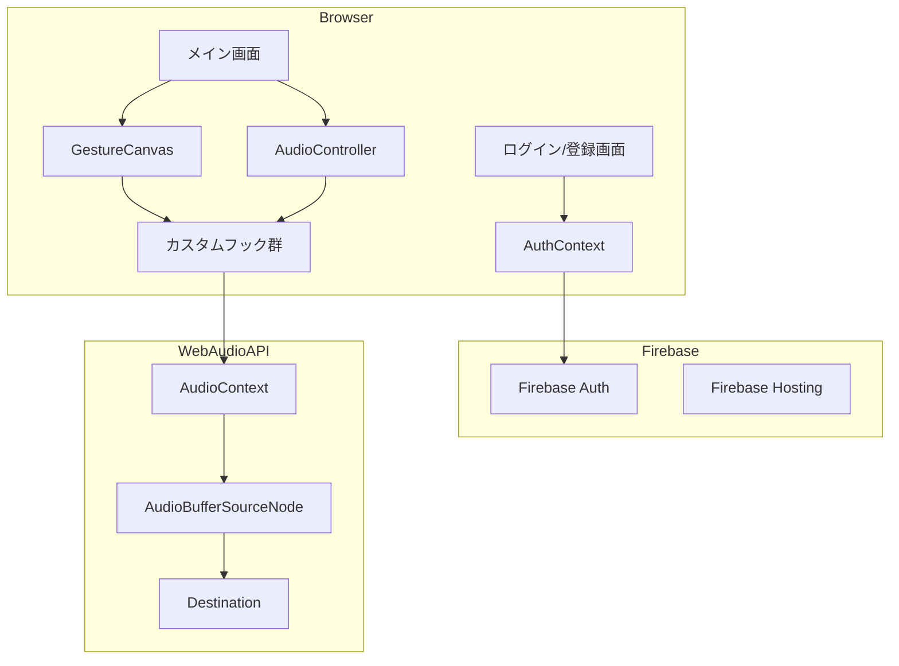
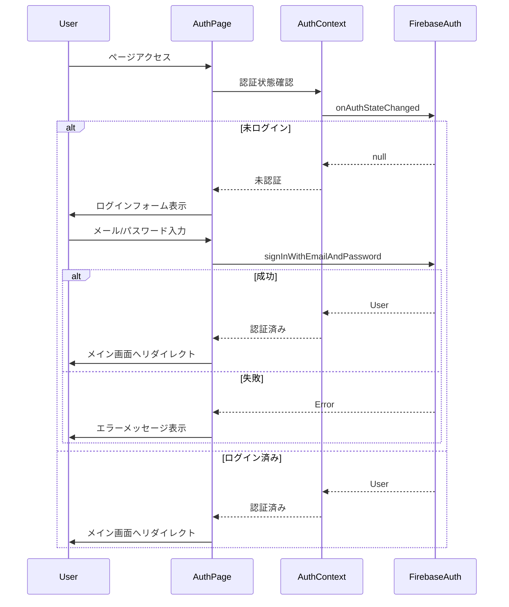
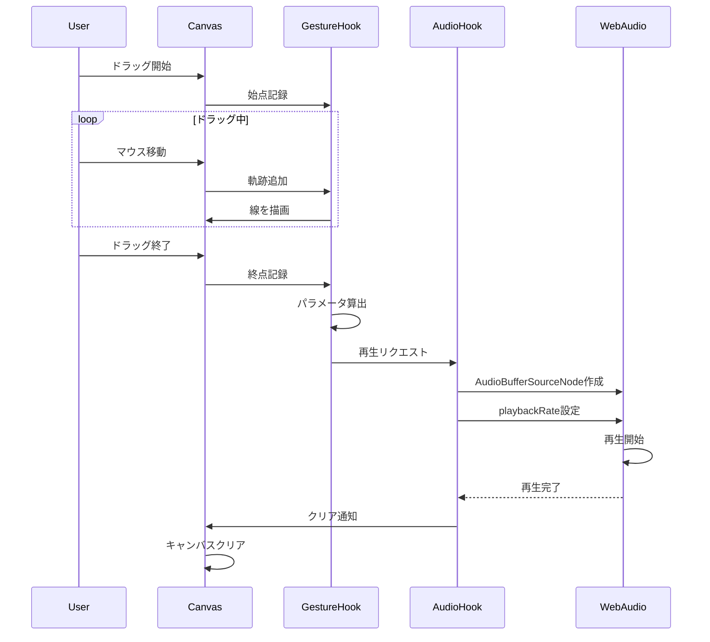
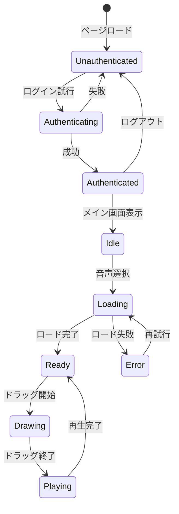
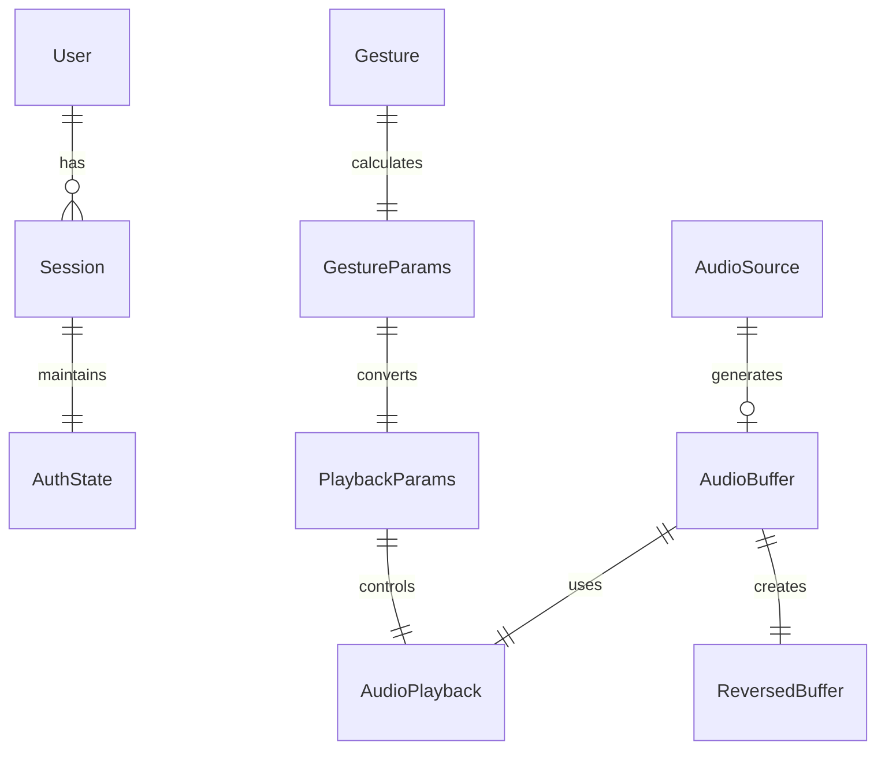

# Design Document: gesture-audio-canvas

## Overview

**Purpose**: キャンバス上のジェスチャー操作で音声を直感的に編集・再生するインタラクティブWebアプリケーションを提供する。

**Users**: 登録済みユーザーが音声を視覚的・体感的に操作する。アート表現、教育、実験的なサウンドデザインに利用される。

**Impact**: 新規アプリケーション。既存システムへの影響なし。

### Goals
- Firebase Authenticationによるメール/パスワード認証
- ドラッグ操作による直感的な音声パラメータ制御
- 線の長さ→再生時間、方向→再生方向、Y位置→ピッチの3パラメータ変換
- Firebase Hostingへの静的デプロイ

### Non-Goals
- 複数音声の同時操作
- 音声ファイルの保存・エクスポート
- 複雑な音声エフェクト（リバーブ、エコー等）
- ソーシャルログイン（Google, Twitter等）

## Architecture

### Architecture Pattern & Boundary Map



**Architecture Integration**:
- Selected pattern: Component-based SPA + Custom Hooks分離 + Context API for Auth
- Domain/feature boundaries: 認証層、UI層（表示）、ロジック層（カスタムフック）を分離
- Existing patterns preserved: N/A（新規開発）
- New components rationale: 認証、音声処理、キャンバス描画の責務を明確に分離
- Steering compliance: N/A（ステアリング未設定）

### Technology Stack

| Layer | Choice / Version | Role in Feature | Notes |
|-------|------------------|-----------------|-------|
| Frontend | React 18 | UIフレームワーク | |
| Framework | Next.js 14/15 | ルーティング、ビルド | `output: 'export'`で静的出力 |
| UI Library | MUI v5/v6 | デザインシステム | |
| Language | TypeScript 5 | 型安全性 | strict mode |
| Audio | Web Audio API | 音声処理 | ブラウザ標準API |
| Auth | Firebase Authentication | ユーザー認証 | Email/Password |
| Backend SDK | Firebase SDK v9+ | Firebase連携 | Modular SDK |
| Infrastructure | Firebase Hosting | 静的ホスティング | CDN配信 |

## System Flows

### 認証フロー



### 音声再生フロー



### アプリケーション状態遷移



## Requirements Traceability

| Requirement | Summary | Components | Interfaces | Flows |
|-------------|---------|------------|------------|-------|
| 1.1 | 音声選択UI | AudioSelector | AudioSelectorProps | - |
| 1.2 | サイン波サンプル | useAudioProcessor | generateSineWave | - |
| 1.3 | 音声ロード | useAudioProcessor | loadAudio | - |
| 1.4 | ロード状態表示 | AudioSelector | isLoading state | - |
| 1.5 | キャンバス有効化 | GestureCanvas | isEnabled prop | - |
| 1.6 | エラー表示 | AudioSelector | error state | - |
| 2.1 | キャンバス表示 | GestureCanvas | - | - |
| 2.2 | ドラッグ受付 | GestureCanvas | onDrag events | - |
| 2.3 | 無効状態表示 | GestureCanvas | isEnabled prop | - |
| 3.1 | 始点記録 | useGestureCanvas | startPoint | ドラッグ開始 |
| 3.2 | 軌跡描画 | useGestureCanvas | path array | ドラッグ中 |
| 3.3 | 終点記録 | useGestureCanvas | endPoint | ドラッグ終了 |
| 4.1 | 直線距離算出 | useGestureCanvas | calculateDistance | パラメータ算出 |
| 4.2, 4.3, 4.4 | 長さ→時間変換 | useAudioProcessor | calculateDurationRate | パラメータ算出 |
| 5.1, 5.2 | 方向→再生方向 | useAudioProcessor | isReverse | 再生準備 |
| 6.1, 6.2, 6.3, 6.4 | Y座標→ピッチ | useAudioProcessor | calculatePitchRate | パラメータ算出 |
| 7.1 | 音声再生 | useAudioProcessor | playAudio | 再生フロー |
| 7.2 | キャンバスクリア | GestureCanvas | onPlaybackEnd | 再生完了 |
| 7.3 | 再描画準備 | GestureCanvas | state reset | 再生完了 |
| 7.4 | 再生中無効化 | GestureCanvas | isPlaying state | 再生中 |
| 8.1 | Firebase Auth使用 | AuthContext, useAuth | Firebase SDK | 認証フロー |
| 8.2 | メール/パスワード認証 | LoginPage | signIn | 認証フロー |
| 8.3 | ログイン画面表示 | LoginPage | - | - |
| 8.4 | アクセス制御 | AuthGuard | isAuthenticated | 認証フロー |
| 8.5 | ログイン後リダイレクト | LoginPage | router.push | 認証フロー |
| 8.6 | ログアウト機能 | Header | signOut | - |
| 8.7 | ログインエラー表示 | LoginPage | error state | 認証フロー |
| 9.1-9.6 | 技術スタック | - | - | - |
| 10.1-10.3 | デプロイ | - | - | - |

## Components and Interfaces

| Component | Domain/Layer | Intent | Req Coverage | Key Dependencies | Contracts |
|-----------|--------------|--------|--------------|------------------|-----------|
| AuthContext | Auth | 認証状態管理 | 8.1, 8.4 | Firebase Auth (P0) | State |
| useAuth | Auth | 認証操作フック | 8.2, 8.6 | AuthContext (P0) | Service |
| AuthGuard | Auth | ルート保護 | 8.4 | useAuth (P0) | - |
| LoginPage | UI | ログイン画面 | 8.2, 8.3, 8.5, 8.7 | useAuth (P0) | State |
| Header | UI | ヘッダーナビゲーション | 8.6 | useAuth (P0) | - |
| MainPage | UI | メインアプリケーション画面 | 1-7 | AuthGuard (P0) | - |
| AudioSelector | UI | 音声ファイル選択UI | 1.1, 1.4, 1.6 | useAudioProcessor (P0) | State |
| GestureCanvas | UI | 描画キャンバス | 2, 3, 7.2, 7.3, 7.4 | useGestureCanvas (P0), useAudioProcessor (P0) | State |
| useAudioProcessor | Logic | 音声処理ロジック | 1.2, 1.3, 4, 5, 6, 7.1 | Web Audio API (P0) | Service |
| useGestureCanvas | Logic | ジェスチャー処理ロジック | 3, 4.1 | Canvas API (P0) | Service |

### Auth Layer

#### AuthContext

| Field | Detail |
|-------|--------|
| Intent | Firebase認証状態をアプリ全体で共有 |
| Requirements | 8.1, 8.5 |

**Responsibilities & Constraints**
- Firebase Authの認証状態監視
- ユーザー情報の保持
- 認証状態変更のブロードキャスト

**Dependencies**
- External: Firebase Authentication SDK (P0)

**Contracts**: State [x]

##### State Management
```typescript
interface AuthContextValue {
  user: User | null;
  isLoading: boolean;
  isAuthenticated: boolean;
}

interface User {
  uid: string;
  email: string | null;
}
```

#### useAuth

| Field | Detail |
|-------|--------|
| Intent | 認証操作（ログイン、ログアウト）を提供 |
| Requirements | 8.2, 8.6 |

**Responsibilities & Constraints**
- メール/パスワードによるログイン
- ログアウト処理
- エラーハンドリング

**Dependencies**
- Inbound: AuthContext — 認証状態 (P0)
- External: Firebase Authentication SDK (P0)

**Contracts**: Service [x]

##### Service Interface
```typescript
interface AuthHook {
  user: User | null;
  isLoading: boolean;
  isAuthenticated: boolean;
  error: string | null;

  signIn: (email: string, password: string) => Promise<void>;
  signOut: () => Promise<void>;
  clearError: () => void;
}
```

#### AuthGuard

| Field | Detail |
|-------|--------|
| Intent | 未認証ユーザーのアクセスを制限 |
| Requirements | 8.5 |

**Responsibilities & Constraints**
- 認証状態の確認
- 未認証時のリダイレクト
- ローディング状態の表示

**Dependencies**
- Inbound: useAuth — 認証状態 (P0)

##### Props Interface
```typescript
interface AuthGuardProps {
  children: React.ReactNode;
  fallback?: React.ReactNode;
}
```

### UI Layer

#### LoginPage

| Field | Detail |
|-------|--------|
| Intent | ログインフォームの表示と認証処理 |
| Requirements | 8.2, 8.3, 8.5, 8.7 |

**Responsibilities & Constraints**
- ログインフォームUI
- 入力バリデーション
- 認証成功時のリダイレクト
- エラーメッセージ表示

**Dependencies**
- Outbound: useAuth — 認証操作 (P0)

**Contracts**: State [x]

##### State Management
```typescript
interface LoginPageState {
  email: string;
  password: string;
  isSubmitting: boolean;
  error: string | null;
}
```

#### Header

| Field | Detail |
|-------|--------|
| Intent | ナビゲーションとログアウトボタン |
| Requirements | 8.7 |

**Responsibilities & Constraints**
- ユーザー情報表示
- ログアウトボタン

**Dependencies**
- Outbound: useAuth — ログアウト操作 (P0)

#### AudioSelector

| Field | Detail |
|-------|--------|
| Intent | 音声ファイルの選択とロード状態の表示 |
| Requirements | 1.1, 1.4, 1.6 |

**Responsibilities & Constraints**
- 音声ファイル選択UIの提供
- ロード中/エラー状態の視覚的フィードバック
- サンプル音源選択オプションの提供

**Dependencies**
- Outbound: useAudioProcessor — 音声ロード処理 (P0)

**Contracts**: State [x]

##### State Management
```typescript
interface AudioSelectorState {
  selectedSource: 'sample' | 'file' | null;
  isLoading: boolean;
  error: string | null;
}
```

##### Props Interface
```typescript
interface AudioSelectorProps {
  onAudioLoaded: (buffer: AudioBuffer) => void;
  onError: (error: string) => void;
}
```

#### GestureCanvas

| Field | Detail |
|-------|--------|
| Intent | ドラッグ操作の受付と軌跡描画 |
| Requirements | 2.1, 2.2, 2.3, 3.1, 3.2, 3.3, 7.2, 7.3, 7.4 |

**Responsibilities & Constraints**
- HTML5 Canvas要素のレンダリング
- マウス/タッチイベントの処理
- 軌跡のリアルタイム描画
- 再生完了後のクリア

**Dependencies**
- Outbound: useGestureCanvas — ジェスチャー処理 (P0)
- Outbound: useAudioProcessor — 音声再生トリガー (P0)

**Contracts**: State [x]

##### State Management
```typescript
interface GestureCanvasState {
  isEnabled: boolean;
  isDrawing: boolean;
  isPlaying: boolean;
  path: Point[];
}

interface Point {
  x: number;
  y: number;
}
```

##### Props Interface
```typescript
interface GestureCanvasProps {
  isEnabled: boolean;
  isPlaying: boolean;
  onGestureComplete: (gesture: GestureData) => void;
}

interface GestureData {
  startPoint: Point;
  endPoint: Point;
  path: Point[];
  distance: number;
}
```

### Logic Layer

#### useAudioProcessor

| Field | Detail |
|-------|--------|
| Intent | 音声の読み込み、加工、再生を管理 |
| Requirements | 1.2, 1.3, 4.2, 4.3, 4.4, 5.1, 5.2, 6.1, 6.2, 6.3, 6.4, 7.1 |

**Responsibilities & Constraints**
- AudioContextの初期化と管理
- AudioBufferの読み込みと保持
- サイン波サンプル音源の生成
- 逆再生用AudioBufferの事前生成
- playbackRateの計算と設定
- 再生状態の管理

**Dependencies**
- External: Web Audio API — 音声処理 (P0)

**Contracts**: Service [x]

##### Service Interface
```typescript
interface AudioProcessorHook {
  // 状態
  audioBuffer: AudioBuffer | null;
  reversedBuffer: AudioBuffer | null;
  isLoading: boolean;
  isPlaying: boolean;
  error: string | null;

  // メソッド
  loadAudioFile: (file: File) => Promise<void>;
  loadSampleAudio: () => Promise<void>;
  playAudio: (params: PlaybackParams) => Promise<void>;
}

interface PlaybackParams {
  isReverse: boolean;
  durationRate: number;
  pitchRate: number;
}
```

**Implementation Notes**
- AudioContextはユーザーインタラクション後に初期化
- `window.AudioContext || window.webkitAudioContext`でブラウザ互換性確保
- 再生完了はAudioBufferSourceNodeの`onended`イベントで検知

#### useGestureCanvas

| Field | Detail |
|-------|--------|
| Intent | キャンバス上のジェスチャーを検出しパラメータに変換 |
| Requirements | 3.1, 3.2, 3.3, 4.1 |

**Responsibilities & Constraints**
- マウス/タッチイベントのハンドリング
- 軌跡の記録と描画
- 始点・終点からのパラメータ算出

**Dependencies**
- External: Canvas 2D API — 描画 (P0)

**Contracts**: Service [x]

##### Service Interface
```typescript
interface GestureCanvasHook {
  // 状態
  canvasRef: RefObject<HTMLCanvasElement>;
  isDrawing: boolean;
  currentPath: Point[];

  // イベントハンドラ
  handlePointerDown: (e: PointerEvent) => void;
  handlePointerMove: (e: PointerEvent) => void;
  handlePointerUp: (e: PointerEvent) => void;

  // ユーティリティ
  clearCanvas: () => void;
  calculateGestureParams: (start: Point, end: Point) => GestureParams;
}

interface GestureParams {
  distance: number;
  isRightward: boolean;
  normalizedY: number; // -1 (top) to 1 (bottom)
}
```

## Data Models

### Domain Model



**Entities**:
- **User**: 認証済みユーザー（uid, email）
- **AudioSource**: 選択された音声ソース（サンプルまたはファイル）
- **AudioBuffer**: デコードされた音声データ
- **Gesture**: ユーザーのドラッグ操作データ

**Value Objects**:
- **Point**: 座標（x, y）
- **GestureParams**: ジェスチャーから算出されたパラメータ
- **PlaybackParams**: 再生に使用するパラメータ

**Invariants**:
- 未認証ユーザーはキャンバス操作不可
- pitchRateは0.25〜4.0の範囲に制限
- durationRateは正の数値
- 再生中は新しいジェスチャーを受け付けない

### Logical Data Model

```typescript
// 認証ユーザー
interface User {
  uid: string;
  email: string | null;
}

// 座標
interface Point {
  x: number;
  y: number;
}

// ジェスチャーデータ
interface GestureData {
  startPoint: Point;
  endPoint: Point;
  path: Point[];
  timestamp: number;
}

// ジェスチャーパラメータ
interface GestureParams {
  distance: number;        // 始点-終点間の直線距離 (px)
  isRightward: boolean;    // x方向が正（右向き）か
  normalizedY: number;     // -1 (上端) to 1 (下端)
}

// 再生パラメータ
interface PlaybackParams {
  isReverse: boolean;      // 逆再生か
  durationRate: number;    // 時間倍率 (distance / 20)
  pitchRate: number;       // ピッチ倍率 (0.25 - 4.0)
}

// アプリケーション状態
interface AppState {
  // 認証
  user: User | null;
  isAuthenticated: boolean;
  // 音声
  audioBuffer: AudioBuffer | null;
  reversedBuffer: AudioBuffer | null;
  isAudioLoaded: boolean;
  isLoading: boolean;
  isPlaying: boolean;
  error: string | null;
}
```

## Error Handling

### Error Strategy
ユーザーに対して明確なフィードバックを提供し、リカバリー可能な状態を維持する。

### Error Categories and Responses

**Authentication Errors**:
- 無効なメールアドレス → "有効なメールアドレスを入力してください"
- メール/パスワード不一致 → "メールアドレスまたはパスワードが正しくありません"
- ネットワークエラー → "ネットワークエラーが発生しました。再試行してください"

**User Errors (4xx相当)**:
- 非対応ファイル形式選択 → "対応していないファイル形式です。WAV, MP3, OGG形式をお試しください"
- ファイルサイズ超過 → "ファイルサイズが大きすぎます"

**System Errors (5xx相当)**:
- AudioContext初期化失敗 → "お使いのブラウザは音声再生に対応していません"
- デコード失敗 → "音声ファイルの読み込みに失敗しました"
- 再生失敗 → "音声の再生に失敗しました。ページを再読み込みしてください"

### Monitoring
- console.errorでエラーログ出力
- UIにエラーメッセージ表示（Snackbar/Alert）

## Testing Strategy

### Unit Tests
- `signIn`: 正しい認証情報でログイン成功
- `signOut`: ログアウト後に認証状態がクリア
- `calculateDurationRate`: 線の長さから正しい時間倍率を算出
- `calculatePitchRate`: Y座標から正しいピッチ倍率を算出（0.25-4.0範囲内）
- `calculateDistance`: 2点間の直線距離を正確に算出
- `generateSineWave`: 5秒間のサイン波AudioBufferを正しく生成
- `reverseAudioBuffer`: AudioBufferのサンプルデータを正しく反転

### Integration Tests
- ログイン→メイン画面リダイレクトフロー
- 未認証アクセス→ログイン画面リダイレクトフロー
- 音声ファイル選択→ロード→AudioBuffer生成フロー
- ドラッグ操作→パラメータ算出→再生トリガーフロー
- 再生完了→キャンバスクリア→再入力可能状態フロー

### E2E/UI Tests
- ログインフォームの入力とバリデーション
- ログイン成功後にメイン画面が表示される
- ログアウト後にログイン画面にリダイレクトされる
- ページロード時にキャンバスが無効状態で表示される
- サンプル音源選択後にキャンバスが有効化される
- キャンバス上でドラッグすると軌跡が描画される
- ドラッグ終了時に音声が再生される
- 再生完了後にキャンバスがクリアされる

## Optional Sections

### Security Considerations
- Firebase Authenticationによる認証
- クライアント側での認証状態管理
- セッショントークンはFirebase SDKが自動管理
- HTTPS経由での通信（Firebase Hosting標準）

### Performance & Scalability
- **音声バッファサイズ**: 大きなファイルはメモリを消費。必要に応じてファイルサイズ上限を設定
- **描画パフォーマンス**: requestAnimationFrameで軌跡描画を最適化
- **ブラウザ互換性**: Chrome, Firefox, Safari, Edgeをサポート対象
- **認証状態キャッシュ**: Firebase SDKがローカルストレージで自動管理
