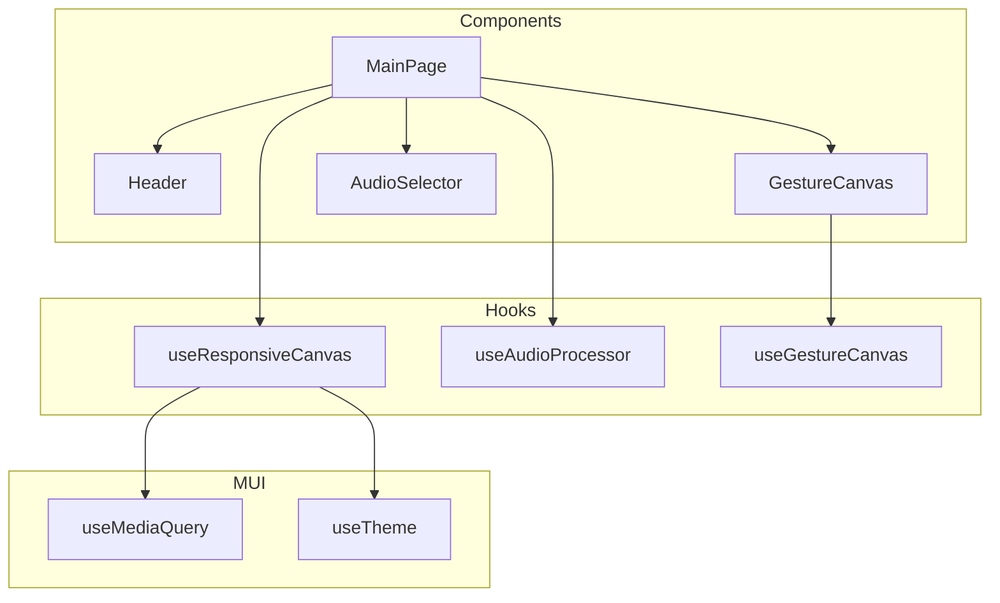

# Technical Design: Responsive Layout

## Overview

**Purpose**: Gesture Audio Canvasアプリケーションのレスポンシブ対応を実現し、モバイル・タブレット・デスクトップなど様々な画面サイズで一貫したユーザー体験を提供する。

**Users**: モバイルデバイス、タブレット、デスクトップPCからアクセスするすべてのユーザーが、画面サイズに最適化されたUIでジェスチャー音声操作を利用できる。

**Impact**: 現在固定サイズ（800x400px）で実装されているキャンバスとUIコンポーネントを、ビューポートサイズに応じて動的にリサイズする。既存の音声処理ロジック（useAudioProcessor）は変更不要。

### Goals
- モバイル（600px未満）、タブレット（600-900px）、デスクトップ（900px以上）の3段階でUIを最適化
- キャンバスのアスペクト比（2:1）を全画面サイズで維持
- タッチ操作の最適化（スクロール/ズーム無効化、適切なタップ領域確保）
- MUIブレイクポイントシステムとの統合

### Non-Goals
- ピクセル単位の連続的なリサイズアニメーション
- 横向き/縦向きの明示的な切り替え対応
- オフライン対応やPWA機能

## Architecture

### Existing Architecture Analysis

**現状のアーキテクチャパターン**:
- カスタムフック分離パターン: `useAudioProcessor`, `useGestureCanvas`, `useAuth`
- UIコンポーネントはプレゼンテーションに集中、ロジックはフックに委譲
- MUI sx propによるスタイリング

**維持すべき制約**:
- 既存の`useAudioProcessor`と`useGestureCanvas`のインターフェースは変更しない
- GestureCanvasの座標計算ロジック（`getBoundingClientRect()`使用）は維持

**統合ポイント**:
- MainPage → GestureCanvas: width/heightをpropsで渡す（既存）
- MainPage → useAudioProcessor: canvasWidth/Heightを関数パラメータで渡す（既存）

### Architecture Pattern & Boundary Map



**Architecture Integration**:
- **Selected pattern**: ハイブリッドアプローチ（新規フック + 既存コンポーネント拡張）
- **Domain boundaries**:
  - `useResponsiveCanvas`: ビューポートサイズ監視とキャンバスサイズ計算
  - 既存コンポーネント: レスポンシブsx prop追加のみ
- **Existing patterns preserved**: カスタムフック分離、sx propスタイリング
- **New components rationale**: サイズ計算ロジックの再利用性とテスト容易性のため新規フック作成
- **Steering compliance**: tech.mdの「カスタムフック分離」パターンに準拠

### Technology Stack

| Layer | Choice / Version | Role in Feature | Notes |
|-------|------------------|-----------------|-------|
| Frontend | React 18 / Next.js 14 | 既存フレームワーク | 変更なし |
| UI Library | MUI v5 | useMediaQuery, theme.breakpoints | 既存依存、追加設定不要 |
| Styling | Emotion | sx propレスポンシブ値 | 既存依存 |

## Requirements Traceability

| Requirement | Summary | Components | Interfaces | Flows |
|-------------|---------|------------|------------|-------|
| 1.1-1.3 | キャンバスサイズのブレイクポイント対応 | useResponsiveCanvas, GestureCanvas, MainPage | CanvasDimensions | - |
| 1.4 | キャンバスサイズ変更時の音声処理 | MainPage | - | ジェスチャー完了フロー |
| 1.5 | アスペクト比維持 | useResponsiveCanvas | CanvasDimensions | - |
| 2.1-2.4 | ヘッダーレスポンシブ対応 | Header | - | - |
| 3.1-3.2 | メインレイアウトのパディング/ギャップ | MainPage | - | - |
| 3.3 | AudioSelectorボタンレイアウト | AudioSelector | - | - |
| 3.4-3.5 | 音量スライダー/Accordion幅 | MainPage | - | - |
| 4.1 | touch-action設定 | GestureCanvas | - | - |
| 4.2-4.3 | マルチタッチ/キャンバス外ドラッグ | useGestureCanvas | - | - |
| 4.4 | タップ領域確保 | Header, AudioSelector | - | - |
| 5.1 | viewport meta tag | layout.tsx | - | - |
| 5.2-5.4 | フォントスケーリング | theme.ts | - | - |

## Components and Interfaces

### Component Summary

| Component | Domain/Layer | Intent | Req Coverage | Key Dependencies | Contracts |
|-----------|--------------|--------|--------------|-----------------|-----------|
| useResponsiveCanvas | Hooks | ビューポートサイズに基づくキャンバスサイズ計算 | 1.1-1.3, 1.5 | useMediaQuery (P0), useTheme (P0) | State |
| MainPage | Pages | レスポンシブレイアウトの統合 | 1.4, 3.1-3.2, 3.4-3.5 | useResponsiveCanvas (P0) | - |
| Header | Components | レスポンシブヘッダー表示 | 2.1-2.4, 4.4 | useTheme (P1) | - |
| GestureCanvas | Components | レスポンシブキャンバス | 4.1 | - | - |
| AudioSelector | Components | レスポンシブボタンレイアウト | 3.3, 4.4 | useTheme (P1) | - |

---

### Hooks Layer

#### useResponsiveCanvas

| Field | Detail |
|-------|--------|
| Intent | ビューポートサイズに基づいてキャンバスの幅・高さを計算し提供する |
| Requirements | 1.1, 1.2, 1.3, 1.5 |

**Responsibilities & Constraints**
- MUIブレイクポイント（sm: 600px, md: 900px）に基づくサイズ計算
- アスペクト比2:1の維持
- SSR環境でのデフォルト値提供

**Dependencies**
- Inbound: MainPage — キャンバスサイズ取得 (P0)
- External: @mui/material/useMediaQuery — ビューポート監視 (P0)
- External: @mui/material/styles/useTheme — ブレイクポイント定義取得 (P0)

**Contracts**: State [x]

##### State Management

```typescript
interface CanvasDimensions {
  width: number;
  height: number;
}

interface UseResponsiveCanvasReturn {
  /** 現在のキャンバスサイズ */
  canvasSize: CanvasDimensions;
  /** モバイル判定（600px未満） */
  isMobile: boolean;
  /** タブレット判定（600px以上900px未満） */
  isTablet: boolean;
  /** デスクトップ判定（900px以上） */
  isDesktop: boolean;
}

function useResponsiveCanvas(): UseResponsiveCanvasReturn;
```

**State model**:
- `canvasSize`: ブレイクポイントに応じた固定値（固定幅方式を採用）
  - モバイル（600px未満）: `{ width: 350, height: 175 }`
  - タブレット（600px以上900px未満）: `{ width: 550, height: 275 }`
  - デスクトップ（900px以上）: `{ width: 800, height: 400 }`

**Design Decision**: 固定幅方式を採用
- **理由**: `useMediaQuery`はブレイクポイントのboolean判定のみを返すため、動的な割合計算より固定値の方がシンプルで予測可能
- **利点**: テスト容易、SSR対応が容易、レイアウトの安定性

**Implementation Notes**
- Integration: `useMediaQuery`で`theme.breakpoints.up('sm')`と`theme.breakpoints.up('md')`を監視
- Validation: 各ブレイクポイントで定義済みの固定サイズを返却
- Risks: SSR時はデスクトップサイズをデフォルトとして返却（`noSsr: true`オプション使用）

---

### Pages Layer

#### MainPage

| Field | Detail |
|-------|--------|
| Intent | レスポンシブレイアウトの統合とキャンバスサイズの動的適用 |
| Requirements | 1.4, 3.1, 3.2, 3.4, 3.5 |

**Responsibilities & Constraints**
- useResponsiveCanvasから取得したサイズをGestureCanvasに渡す
- ブレイクポイントに応じたパディング・ギャップの調整
- Accordion幅をキャンバス幅と同期

**Dependencies**
- Inbound: App Router — ページレンダリング (P0)
- Outbound: useResponsiveCanvas — キャンバスサイズ取得 (P0)
- Outbound: GestureCanvas — サイズprops渡し (P0)
- Outbound: useAudioProcessor — canvasWidth/Height渡し (P0)

**Contracts**: なし（既存インターフェース維持）

**Implementation Notes**
- Integration: 定数`CANVAS_WIDTH`, `CANVAS_HEIGHT`を`useResponsiveCanvas`の戻り値に置換
- Validation: Container sx propでレスポンシブ値を設定（`py: { xs: 2, sm: 4 }`, `gap: { xs: 2, sm: 4 }`）
- Risks: handleGestureComplete内のcanvasWidth/Height参照を動的値に更新必要

---

### Components Layer

#### Header

| Field | Detail |
|-------|--------|
| Intent | 画面サイズに応じたヘッダー情報の表示切り替え |
| Requirements | 2.1, 2.2, 2.3, 2.4, 4.4 |

**Responsibilities & Constraints**
- モバイル: 短縮タイトル、メールアドレス非表示、アイコンのみログアウトボタン
- デスクトップ: フルタイトル、メールアドレス表示、テキスト付きログアウトボタン
- 最小タップ領域44x44px確保

**Dependencies**
- Inbound: MainPage — レンダリング (P0)
- External: @mui/material/styles/useTheme — ブレイクポイント取得 (P1)

**Contracts**: なし

**Implementation Notes**
- Integration: sx propで`display: { xs: 'none', sm: 'block' }`形式のレスポンシブ値を使用
- Validation: IconButtonに`sx={{ minWidth: 44, minHeight: 44 }}`を設定
- Risks: タイトル短縮時の文字列は「GAC」（Gesture Audio Canvasの略）を使用

#### GestureCanvas

| Field | Detail |
|-------|--------|
| Intent | レスポンシブサイズ対応と既存タッチ操作の維持 |
| Requirements | 4.1 |

**Responsibilities & Constraints**
- propsで受け取ったwidth/heightを適用
- touch-action: noneの維持（既存実装）

**Dependencies**
- Inbound: MainPage — width/height props (P0)

**Contracts**: なし（既存インターフェース維持）

**Implementation Notes**
- Integration: 変更なし（既存のwidth/height propsを活用）
- Validation: touch-action: noneは既存実装で対応済み
- Risks: なし

#### AudioSelector

| Field | Detail |
|-------|--------|
| Intent | 画面サイズに応じたボタンレイアウト切り替え |
| Requirements | 3.3, 4.4 |

**Responsibilities & Constraints**
- モバイル: ボタン縦並び（`direction: 'column'`）
- デスクトップ: ボタン横並び（`direction: 'row'`）
- 最小タップ領域44x44px確保

**Dependencies**
- Inbound: MainPage — レンダリング (P0)
- External: @mui/material/styles/useTheme — ブレイクポイント取得 (P1)

**Contracts**: なし

**Implementation Notes**
- Integration: Stack directionをsx propでレスポンシブ化（`direction: { xs: 'column', sm: 'row' }`）
- Validation: Buttonに`sx={{ minHeight: 44 }}`を設定
- Risks: なし

---

### Library Layer

#### theme.ts

| Field | Detail |
|-------|--------|
| Intent | レスポンシブフォントサイズの設定 |
| Requirements | 5.2, 5.3, 5.4 |

**Implementation Notes**
- Integration: MUIのresponsiveFontSizesユーティリティは不使用（過剰）
- Validation: typography設定でrem単位を維持（既存）
- Risks: なし（MUIデフォルトのフォントサイズで要件充足）

#### layout.tsx

| Field | Detail |
|-------|--------|
| Intent | viewport meta tagの設定 |
| Requirements | 5.1 |

**Implementation Notes**
- Integration: Next.js 14のmetadata APIで`viewport`を設定
- Validation: `width=device-width, initial-scale=1.0`を確認

---

## Error Handling

### Error Strategy
レスポンシブ対応は主にUI表示に関わるため、致命的なエラーは発生しない。

### Error Categories and Responses
- **ブレイクポイント取得失敗**: デスクトップサイズ（800x400）をフォールバックとして使用
- **SSR環境**: noSsrオプションでクライアントサイドのみ実行、初期値はデスクトップサイズ

---

## Testing Strategy

### Unit Tests
- `useResponsiveCanvas`: 各ブレイクポイントでの正しいサイズ計算
- `useResponsiveCanvas`: アスペクト比2:1の維持
- `useResponsiveCanvas`: 最小幅280pxの制限

### Integration Tests
- MainPage: キャンバスサイズがGestureCanvasに正しく渡される
- MainPage: 動的キャンバスサイズでhandleGestureCompleteが正しく動作
- Header: モバイル/デスクトップでの表示切り替え

### E2E/UI Tests
- モバイルビューポートでのキャンバス表示確認
- タブレットビューポートでのレイアウト確認
- デスクトップビューポートでの既存動作維持
